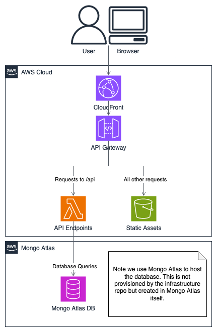
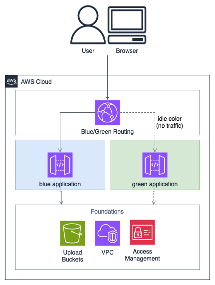
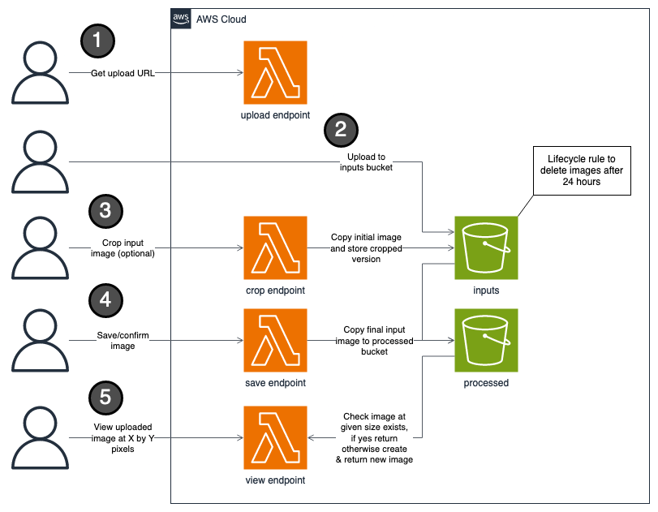

# Plum Tree Infrastructure

> Bite my shiny metal ass!

This repo covers the underlying AWS infrastructure needed to host the Plum Tree.

We uses Terraform to create this underlying infrastructure as to be able to create it repeatably and reliably as code to minimize human error. It also serves as documentation instead of creating the resources manually we know exactly whats created by looking at the code.

When first starting you'll want to deploy in the following order:

1. [foundation](./foundation/)
2. [application](./application/)
3. [blue-green](./blue-green/)

## High Level Overview

The Plum tree is a basic website that has front end static assets (HTML, JavaScript, CSS) and a API backend (NodeJS).

All of this is served by a AWS API GateWay and AWS CloudFront.

Requests for the API (any request going to https://theplumtreapp.com/api/*) will go to Lambda functions to perform the logic requested and send a response. Using Lambda means we only pay for the time a request is being handled and don't have to have servers running constantly (a practice known as serverless).

Any other requests (for static assets) are forwarded to S3 where the static assets are stored. S3 buckets give us cheap reliable storage to host these static assets.

This repo provisions the API gateway and S3 buckets to host the code. However the code itself for the API and static assets are in their own repos and deployed into this infrastructure.

## Blue Green Stacks

The very foundational stuff (such as VPC network and upload S3 buckets) is created once. The code for this is in [/foundation](./foundation/).

However the application resources on top of that is actually deployed twice. These two versions or stacks are known as `blue` and `green`. This is all found in [/application](./application/).

The final layer above that points to either the `blue` or `green` application. There is only ever one color active at a time while the other sits idle. Users when accessing the Plum Tree will go to the Plum Trees URL which points to either the `blue` or `green` stack. This routing is all found and configured in [/blue-green](./blue-green/).

What this means is we can release updates to the idle color. Then test the changes without affecting the live service. Once we're happy with the changes we flip the colors so users can see the new release and the previously live color now becomes the idle color.

While users will use the URl https://theplumtreeapp.com we can bypass the blue green routing for testing by going to either https://blue.theplumtreeapp.com or green.theplumtreeapp.com.

## Upload Buckets

One of the core parts of the Plum Tree is the ability to upload images. To provide a reliable and cost effective mechanism to upload images we create infrastructure and logic to upload, process and serve these images.

How uploading works at a high level is:

1. A user sends a API call to request uploading an image (Get a presigned S3 URL)
2. With the presigned S3 URL the user uploads their image to the "input" bucket
3. The user can crop this original uploaded image which adds a new cropped version to the "input" bucket
4. When a user is done they can "save" the image which copies the final cropped image to the "processed" bucket

Then in the background we delete any files in the "input" bucket after 24 hours. Whenever we need to display the image we use the file final cropped and "saved" file we copied to the "processed" bucket.

When we request to display the image we never (or at least very rarely) use the full "processed" image but instead request a downsized version. If a version at the requested dimensions exists we show that. If not we generate a new copy of that image, store it for future requests and show the newly generated image. This allows us to keep an original but also serve downsized images for cheaper and faster bandwidth.

## Deploying

This repo uses GitLab CICD to test and deploy changes. While you can run the Terraform commands needed locally it's often more reliable (less human error) to do so via the deploy pipeline.

These pipeline steps are configured in `.gitlab-ci.yml` and expect the `AWS_SECRET_ACCESS_KEY` and `AWS_ACCESS_KEY_ID` variables to be set.

By default the pipeline will only run steps for the `foundation` folder. This is because the `application` and `blue-green` folders and Terraform code within expect the `COLOR` variable to also be passed. You can pass this variable when manually triggering a pipeline.

## Further Reading

Each folder [/foundation](./foundation/), [/application](./application/) and [/blue-green](./blue-green/) contains a `README.md` with further more focused documentation of what that folder creates.

The UI and API repo also contains documentation of their respective areas with even more detail on the application code for the Plum Tree.

If you feel any documentation is missing or unclear please contribute and either open an [issue](https://gitlab.com/plum-tree/infrastructure/-/issues) or [merge request](https://gitlab.com/plum-tree/infrastructure/-/merge_requests) to improve this codebase.
